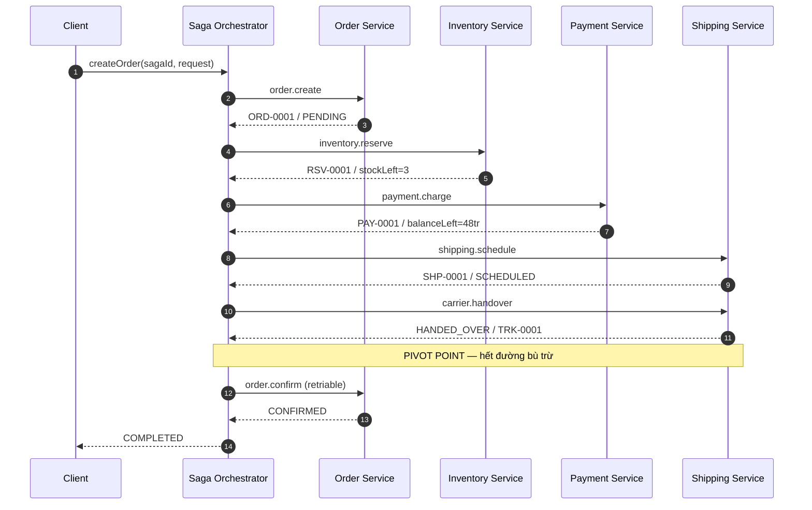
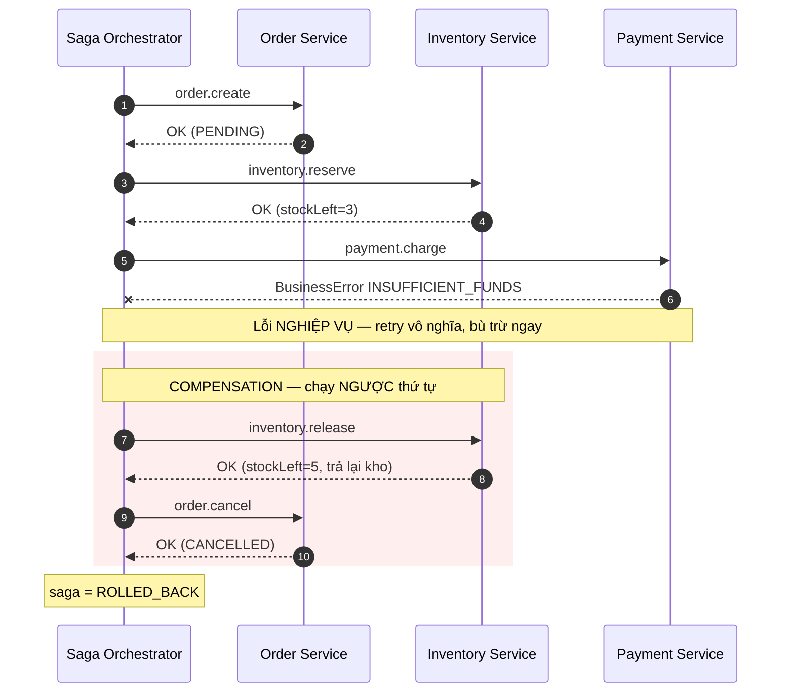
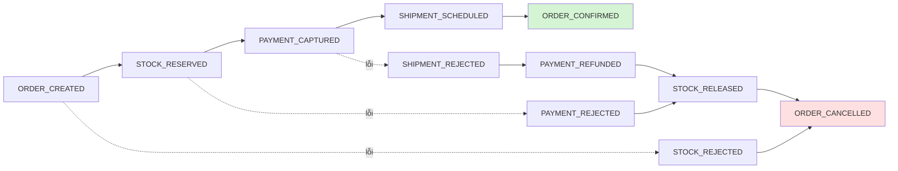

# Saga Pattern với Node.js

Ví dụ chạy được về **Saga Pattern** — cách giữ tính nhất quán cho một giao dịch
trải trên nhiều microservice, khi không còn `BEGIN ... COMMIT / ROLLBACK` chung.

Luồng nghiệp vụ mô phỏng: **đặt hàng**

```
order.create → inventory.reserve → payment.charge → shipping.schedule
             → carrier.handover (PIVOT) → order.confirm
```

Node.js thuần, **không cần cài gì cả** (0 dependency, không cần database), log
từng bước ra terminal để nhìn rõ luồng thuận và luồng bù trừ.

---

## Mục lục

1. [Saga Pattern là gì](#1-saga-pattern-là-gì)
2. [Tại sao không dùng 2PC](#2-tại-sao-không-dùng-2pc)
3. [Orchestration vs Choreography](#3-orchestration-vs-choreography)
4. [Sơ đồ luồng thực thi](#4-sơ-đồ-luồng-thực-thi)
5. [Pivot point: không phải cứ lỗi là rollback](#5-pivot-point-không-phải-cứ-lỗi-là-rollback)
6. [Cấu trúc thư mục và vai trò từng file](#6-cấu-trúc-thư-mục-và-vai-trò-từng-file)
7. [Cài đặt và chạy demo](#7-cài-đặt-và-chạy-demo)
8. [Output mẫu](#8-output-mẫu)
9. [Lưu ý thực tế khi áp dụng](#9-lưu-ý-thực-tế-khi-áp-dụng)

---

## 1. Saga Pattern là gì

Trong kiến trúc monolith, một nghiệp vụ "đặt hàng" nằm gọn trong một database
transaction:

```sql
BEGIN;
  INSERT INTO orders ...;
  UPDATE products SET stock = stock - 2 ...;
  UPDATE wallets SET balance = balance - 52000000 ...;
  INSERT INTO shipments ...;
COMMIT;   -- lỗi ở bất kỳ đâu -> ROLLBACK, coi như chưa có gì xảy ra
```

Khi tách thành microservice, mỗi service có database riêng. Không còn một
transaction nào bao trùm được cả 4 bước. Nếu bước thanh toán lỗi, hàng đã bị
giữ trong kho — và không có `ROLLBACK` nào chạm tới được database của
Inventory Service.

**Saga** giải bài toán này bằng cách chia một business transaction thành nhiều
**local transaction**. Mỗi local transaction commit ngay trong DB của service
sở hữu nó. Nếu một bước thất bại, saga chạy các **compensating transaction**
(giao dịch bù trừ) cho những bước đã commit trước đó, theo **thứ tự ngược**.

```
Thuận:  order.create ✓ → inventory.reserve ✓ → payment.charge ✗
Bù trừ:                  inventory.release ← order.cancel
```

### Compensation KHÔNG phải rollback

Đây là chỗ hay bị hiểu sai nhất. Rollback nghĩa là "coi như chưa từng xảy ra".
Compensation là **một transaction mới, ngược dấu, và nó cũng để lại dấu vết**.

Xem file [`src/services/paymentService.js`](src/services/paymentService.js):
khi hoàn tiền, ta không xoá bút toán `CHARGE`, mà ghi thêm một bút toán
`REFUND` mới trỏ về nó. Chạy demo và xem trạng thái cuối của scenario `retry`:

```
- wallet CUS-01: 100.000.000đ                              <- số dư đã về đúng
- payments: PAY-0001/CHARGE/52.000.000đ, PAY-0002/REFUND/52.000.000đ
            ^^^^^^^^^^^^^^^^^^^^^^^^^^  cả hai bút toán đều còn nguyên
```

Nếu là `ROLLBACK` thật thì `PAY-0001` phải biến mất. Ở đây nó vẫn còn — đúng
nguyên tắc kế toán, và cũng đúng thực tế: khách hàng đã nhìn thấy tiền bị trừ
rồi, ngân hàng đã ghi nhận, không ai "làm như chưa có gì".

Điều này dẫn tới ba hệ quả phải chấp nhận từ đầu:

| | ACID transaction | Saga |
|---|---|---|
| Atomicity | Có | Có (nhờ compensation) |
| Consistency | Có | **Eventual** — có khoảng thời gian dữ liệu "lệch" |
| Isolation | Có | **Không có** — service khác đọc thấy trạng thái trung gian |
| Durability | Có | Có |

Mất **Isolation** là cái giá lớn nhất. Giữa lúc `inventory.reserve` xong và
`payment.charge` chưa xong, tồn kho đã giảm dù đơn hàng có thể sẽ bị huỷ. Cách
xử lý là **semantic lock**: không trừ hẳn mà đánh dấu "đang giữ" (`status: HELD`
trong [`src/services/inventoryService.js`](src/services/inventoryService.js)).

---

## 2. Tại sao không dùng 2PC

**Two-Phase Commit** (2PC / XA) về lý thuyết giải được bài toán này: có một
transaction coordinator, phase 1 hỏi tất cả participant "sẵn sàng chưa?", phase
2 ra lệnh commit hoặc abort đồng loạt.

Thực tế nó gần như không dùng được trong microservices:

**1. Blocking và giữ lock quá lâu.** Giữa phase 1 và phase 2, mọi participant
phải giữ lock trên dữ liệu của mình. Với một luồng gọi qua 5 service, mạng
chậm 100ms mỗi chặng, lock bị giữ cả nửa giây. Throughput sụp.

**2. Coordinator là single point of failure.** Nếu coordinator chết sau khi
participant đã trả lời "prepared", participant bị treo vô định — không được
commit, không được abort, mà vẫn phải giữ lock. Đây gọi là *in-doubt
transaction*, và nó cần con người vào gỡ.

**3. Rất nhiều thứ không hỗ trợ XA.** Kafka, Redis, MongoDB (theo cách thường
dùng), hầu hết REST API của đối tác, cổng thanh toán, API của hãng vận
chuyển... Không thể "prepare" một lệnh gọi API sang cổng thanh toán rồi lát sau
mới quyết định commit.

**4. Không mở rộng được ra ngoài biên hệ thống.** Ngay cả khi mọi service của
bạn dùng PostgreSQL với XA, cái Sở giao dịch / ngân hàng / hãng vận chuyển ở
đầu bên kia sẽ không tham gia vào transaction của bạn.

**5. Vi phạm nguyên tắc tự trị của microservice.** 2PC làm các service phụ
thuộc chặt vào nhau về mặt thời gian (temporal coupling): một service chậm là
cả giao dịch chậm; một service chết là cả giao dịch treo.

Saga đổi hướng tiếp cận: **thay vì cố giữ atomicity tức thời, ta chấp nhận
eventual consistency và tự viết đường lùi**. Không có lock phân tán, mỗi bước
commit ngay, service nào lỗi thì hệ thống biết cách dọn.

---

## 3. Orchestration vs Choreography

Có hai cách điều phối một saga. Ví dụ này triển khai **cả hai**, dùng chung
đúng bộ service ở [`src/services/`](src/services) — chỉ khác cách gắn chúng lại.

### Orchestration — có bộ điều phối trung tâm

Một orchestrator biết toàn bộ luồng, gọi lần lượt từng service và tự quyết định
khi nào phải bù trừ. Service không biết gì về nhau.

Code: [`src/orchestration/sagaOrchestrator.js`](src/orchestration/sagaOrchestrator.js)
(engine) + [`src/orchestration/orderSaga.js`](src/orchestration/orderSaga.js)
(khai báo luồng).

```
                 ┌──────────────────────┐
        ┌────────│  SAGA ORCHESTRATOR   │────────┐
        │        └──────────┬───────────┘        │
        │  1,cancel         │ 2,release          │ 3,refund
        ▼                   ▼                    ▼
   ┌─────────┐      ┌──────────────┐      ┌───────────┐
   │  Order  │      │  Inventory   │      │  Payment  │
   └─────────┘      └──────────────┘      └───────────┘
```

### Choreography — dựa trên event

Không có orchestrator. Mỗi service lắng nghe event của bước trước, làm phần
việc của mình, rồi phát ra event của mình. Luồng nghiệp vụ không nằm trong file
nào cả — nó *hiện ra* từ cách các service phản ứng với nhau.

Code: [`src/choreography/handlers.js`](src/choreography/handlers.js) +
[`src/infra/eventBus.js`](src/infra/eventBus.js).

```
  ┌─────────┐  ORDER_CREATED   ┌───────────┐  STOCK_RESERVED  ┌─────────┐
  │  Order  │─────────────────►│ Inventory │─────────────────►│ Payment │
  └─────────┘                  └───────────┘                  └─────────┘
       ▲                             ▲                              │
       │      STOCK_RELEASED         │      PAYMENT_REJECTED        │
       └─────────────────────────────┴──────────────────────────────┘
                    (chuỗi bù trừ cũng chỉ là event)
```

### So sánh

| | **Orchestration** | **Choreography** |
|---|---|---|
| Nơi chứa logic luồng | Tập trung ở orchestrator | Rải rác trong các service |
| Đọc hiểu nghiệp vụ | Dễ — mở 1 file thấy hết luồng | Khó — phải đọc mọi service |
| Coupling | Orchestrator biết mọi service | Service chỉ biết event, không biết nhau |
| Thêm bước mới | Sửa orchestrator (1 chỗ) | Thêm subscriber (không sửa ai) |
| Nguy cơ | Orchestrator phình thành God Service | Vòng lặp event, luồng ẩn không ai kiểm soát |
| Debug / trace | Dễ — có saga log tập trung | Khó — cần distributed tracing |
| Trạng thái saga | Có sẵn, một chỗ | Phải suy ra từ trạng thái nghiệp vụ |
| Timeout toàn cục | Dễ áp | Rất khó — không ai "sở hữu" cả luồng |
| Điểm chết đơn lẻ | Orchestrator (phải HA) | Không có |
| Độ trễ | Thấp hơn nếu gọi trực tiếp | Cộng thêm 1 chặng broker mỗi bước |

### Khi nào dùng cái nào

**Dùng Orchestration khi:**

- Luồng dài (từ 4 bước trở lên) hoặc có nhánh, có điều kiện.
- Nghiệp vụ quan trọng, cần trace được "đơn này đang ở bước nào".
- Cần timeout cho cả giao dịch, cần retry theo chính sách khác nhau ở từng bước.
- Cần một chỗ để trả lời "saga nào đang treo" cho ops.
- **Mặc định nên chọn cái này** cho nghiệp vụ giao dịch tiền / hàng.

**Dùng Choreography khi:**

- Luồng ngắn (2–3 bước), tuyến tính, ít khả năng đổi.
- Các service thuộc các team khác nhau, muốn giảm phụ thuộc tổ chức.
- Nhiều consumer quan tâm cùng một event (analytics, notification, loyalty...) —
  thêm consumer mới mà không sửa gì ở phía publisher.
- Hệ thống đã event-driven sẵn.

**Kết hợp** là chuyện bình thường và thường là lựa chọn đúng: orchestration cho
lõi giao dịch (cần kiểm soát chặt), choreography cho các tác vụ phụ trợ ăn theo
(gửi mail, cộng điểm, cập nhật báo cáo).

---

## 4. Sơ đồ luồng thực thi

### 4.1 Case thành công (orchestration)



### 4.2 Case rollback (orchestration)



### 4.3 Ba vùng của một saga (ASCII)

```
      TRƯỚC PIVOT: COMPENSATION            ||     SAU PIVOT: FORWARD RECOVERY
                                           ||
  (1)          (2)            (3)          (4)     ||    (5)            (6)
 order   -> inventory  ->  payment  ->  shipping   ||  carrier    ->   order
 .create    .reserve       .charge      .schedule  ||  .handover       .confirm
   |            |             |             |      ||      |              |
   v            v             v             v      ||      v              v
 order      inventory      payment       shipping  ||  KHÔNG CÓ       retry /
 .cancel    .release       .refund       .cancel   ||  bù trừ         replay /
   ^            ^             ^             ^      ||  (phải mở       reconcile
   |            |             |             |      ||  quy trình      -> DLQ nếu
   +------------+-------------+-------------+      ||  hoàn hàng)     hết lượt
        bù trừ, chạy NGƯỢC thứ tự                  ||
                                                 PIVOT
```

### 4.4 Chuỗi event của choreography



Điểm cần để ý: **compensation ở choreography cũng chỉ là event bình thường**.
Không có ai "ra lệnh rollback" — mỗi service tự biết phải nhả thứ mình đang giữ
khi nghe tin bước sau thất bại.

---

## 5. Pivot point: không phải cứ lỗi là rollback

Đây là phần các ví dụ Saga trên mạng thường bỏ qua, nhưng lại là phần quan
trọng nhất khi làm hệ thật.

Không phải bước nào cũng bù trừ được. Có một ranh giới — gọi là **pivot point**
— mà sau khi vượt qua, việc "đảo ngược" không còn là một transaction nữa mà là
một **quy trình nghiệp vụ mới**, tốn tiền thật và cần con người.

Saga chuẩn chia một luồng thành ba vùng:

| Loại step | Ý nghĩa | Khi lỗi thì làm gì |
|---|---|---|
| `compensatable` | Còn bù trừ được | Chạy compensation ngược thứ tự |
| `pivot` | Điểm không quay đầu | Lỗi *tại* pivot → vẫn bù trừ được (chưa commit). Qua rồi → khoá vùng bù trừ |
| `retriable` | Nằm sau pivot | **Chỉ được đi tiếp**: retry / replay / reconcile. Cấm bù trừ |

Trong ví dụ này, `carrier.handover` (tài xế quét mã, nhận hàng, rời kho) là
pivot. Bạn thấy trong [`src/orchestration/orderSaga.js`](src/orchestration/orderSaga.js)
nó là step duy nhất **không có** hàm `compensate` — và đó là chủ ý, không phải
thiếu sót.

Ví dụ tương đương trong hệ thống giao dịch chứng khoán: pivot là lúc Sở
**ACCEPT** lệnh. Trước đó còn `Reserve → Release`, `Hold → Unhold`. Sau đó
không thể "rollback lệnh" — muốn đảo ngược phải gửi Cancel Order, mà Cancel còn
có thể thất bại nếu lệnh đã khớp một phần.

### Timeout không đồng nghĩa với Failed

Hệ quả trực tiếp: khi gọi một service qua pivot mà bị timeout, **bạn không biết
nó thành công hay thất bại**. Đây là *in-doubt transaction*.

```
Gateway  ── request ──►  Đối tác / Sở
                              │
                           ACCEPT   (đã xử lý xong!)
                              │
Gateway  ◄──── X ─────────────┘   (mất kết nối trước khi nhận response)
```

Chuyển ngay sang `FAILED` rồi nhả tiền/nhả hàng là con đường ngắn nhất tới
double-spend. State machine phải có trạng thái trung gian:

```
SENT → UNKNOWN → RECONCILE → ACCEPTED | REJECTED
```

Và **không được nhả reservation chỉ vì timeout**. Giữ thêm vài phút thì khách
bất tiện; nhả sai thì mất tiền và sai sổ sách.

Xem scenario `pivot` trong demo: `order.confirm` lỗi sau khi hàng đã lên xe.
Saga **không** rollback — nó retry 4 lần, hết lượt thì đẩy vào DLQ với trạng
thái `PENDING_RECOVERY` để job recovery xử lý tiếp:

```
  6. order.confirm  FAIL  TransientError[DB_TIMEOUT] ... attempt 4/4
  => FORWARD RECOVERY order.confirm nằm sau pivot -> retry/replay, tuyệt đối không bù trừ
  [DLQ] type=FORWARD_RECOVERY_REQUIRED saga=SAGA-0005 step=order.confirm
[saga SAGA-0005] ## PENDING_RECOVERY
```

Trạng thái cuối: đơn vẫn `PENDING`, tiền vẫn đã trừ, hàng vẫn đang trên đường.
**Đó là trạng thái đúng** — vì hàng đi rồi thì huỷ đơn mới là sai.

---

## 6. Cấu trúc thư mục và vai trò từng file

```
146_saga_pattern_nodejs/
├── package.json                      # scripts chạy demo, 0 dependency
├── README.md
└── src/
    ├── infra/                        # HẠ TẦNG — thứ mọi saga thật đều cần
    │   ├── logger.js
    │   ├── store.js
    │   ├── errors.js
    │   ├── faults.js
    │   ├── util.js
    │   └── eventBus.js
    ├── services/                     # 4 SERVICE độc lập, mỗi cái 1 "DB" riêng
    │   ├── serviceKit.js
    │   ├── orderService.js
    │   ├── inventoryService.js
    │   ├── paymentService.js
    │   └── shippingService.js
    ├── orchestration/                # CÁCH 1: bộ điều phối trung tâm
    │   ├── sagaOrchestrator.js
    │   └── orderSaga.js
    ├── choreography/                 # CÁCH 2: dựa trên event
    │   ├── handlers.js
    │   └── runner.js
    └── demo/
        ├── scenarios.js
        └── run.js
```

### Hạ tầng — `src/infra/`

| File | Vai trò |
|---|---|
| [`errors.js`](src/infra/errors.js) | Hai lớp lỗi: `BusinessError` (hết tiền, hết hàng — retry vô nghĩa) và `TransientError` (timeout, 503 — retry được). **Phân biệt được hai loại này là điều kiện tiên quyết** để viết retry đúng. |
| [`store.js`](src/infra/store.js) | In-memory store thay database: `orders`, `products`, `wallets`, `payments`, `shipments`, cộng thêm hạ tầng saga (**saga log**, **bảng idempotency**, **DLQ**). Có `snapshot()` in trạng thái cuối để *kiểm chứng* rollback thật sự xảy ra. |
| [`eventBus.js`](src/infra/eventBus.js) | Event bus thay Kafka/RabbitMQ. Mô phỏng bất đồng bộ và **at-least-once delivery** (bật `redeliver` để giao lại event, kiểm tra handler có idempotent thật hay không). |
| [`faults.js`](src/infra/faults.js) | Bộ tiêm lỗi. Khai báo `{ 'payment.charge': { kind: 'business', ... } }` để mô phỏng từng nhánh thất bại. `times: 2` = lỗi 2 lần đầu rồi thành công → demo retry cứu được lỗi tạm thời. |
| [`logger.js`](src/infra/logger.js) | Log có màu, phân biệt rõ bước thuận (`OK`/`FAIL`), bước bù trừ (`<-`), pivot, forward recovery và DLQ. Hỗ trợ `--no-color` / `NO_COLOR`. |
| [`util.js`](src/infra/util.js) | `sleep()` mô phỏng độ trễ mạng, `money()` format VND, `kv()` format log. |

### Service nghiệp vụ — `src/services/`

Mỗi file là một service độc lập, chỉ chạm vào "khoang" dữ liệu của mình. Mỗi
service có cặp **hành động thuận + hành động bù trừ**:

| File | Thuận | Bù trừ | Ghi chú |
|---|---|---|---|
| [`orderService.js`](src/services/orderService.js) | `createOrder` (PENDING), `confirmOrder` (CONFIRMED) | `cancelOrder` (CANCELLED + lý do) | `confirmOrder` nằm sau pivot nên là `retriable` |
| [`inventoryService.js`](src/services/inventoryService.js) | `reserveStock` | `releaseStock` | Dùng **semantic lock**: `status: HELD` chứ không trừ hẳn. `releaseStock` kiểm tra `ALREADY_RELEASED` để chịu được gọi nhiều lần |
| [`paymentService.js`](src/services/paymentService.js) | `charge` (bút toán `CHARGE`) | `refund` (bút toán `REFUND` **mới**) | Nơi thể hiện rõ nhất "compensation ≠ rollback" |
| [`shippingService.js`](src/services/shippingService.js) | `scheduleDelivery`, `handoverToCarrier` | `cancelDelivery` | `handoverToCarrier` là **PIVOT** — cố tình không có compensation |
| [`serviceKit.js`](src/services/serviceKit.js) | — | — | Bọc mọi action với 3 thứ bắt buộc: độ trễ mô phỏng, điểm tiêm lỗi, và **idempotency guard** khoá theo `sagaId:action` |

`serviceKit.js` là file nhỏ nhưng đáng đọc kỹ — thứ tự các lớp bọc rất quan
trọng: guard nằm ngoài cùng nên bản replay không sleep, không tiêm lỗi, không
ghi DB; còn lỗi thì **không được cache**, để retry vẫn chạy lại thật.

### Orchestration — `src/orchestration/`

| File | Vai trò |
|---|---|
| [`sagaOrchestrator.js`](src/orchestration/sagaOrchestrator.js) | Engine dùng lại được. Xử lý: chạy tuần tự, **retry chỉ với lỗi tạm thời** + exponential backoff, ghi saga log sau mỗi bước, bù trừ ngược thứ tự, xử lý 3 loại step (`compensatable`/`pivot`/`retriable`), và đẩy DLQ khi bù trừ thất bại. |
| [`orderSaga.js`](src/orchestration/orderSaga.js) | **Chỉ khai báo**, không có logic: mảng 6 step, mỗi step gồm `name` / `type` / `invoke` / `compensate` / `retry`. Muốn đổi luồng nghiệp vụ thì sửa duy nhất file này. |

### Choreography — `src/choreography/`

| File | Vai trò |
|---|---|
| [`handlers.js`](src/choreography/handlers.js) | Đăng ký "service nào nghe event nào, làm xong phát event gì". Cả chuỗi thuận và chuỗi bù trừ. Không có file nào chứa toàn bộ luồng — đó chính là bản chất choreography. |
| [`runner.js`](src/choreography/runner.js) | Khởi động saga: chạy local transaction đầu tiên rồi publish `ORDER_CREATED` (mô phỏng **Transactional Outbox**), chờ bus rỗng, rồi *suy ra* trạng thái saga từ trạng thái đơn hàng. |

### Demo — `src/demo/`

| File | Vai trò |
|---|---|
| [`scenarios.js`](src/demo/scenarios.js) | 9 scenario: happy path, rollback, retry, pivot, compensation thất bại, idempotency, và 3 scenario choreography. Mỗi scenario tự khai báo dữ liệu gốc và lỗi cần tiêm. |
| [`run.js`](src/demo/run.js) | CLI: chạy tất cả hoặc chọn từng scenario, reset dữ liệu giữa các lần, in trạng thái cuối + DLQ + bảng tổng kết. |

### Bảng trạng thái saga

| Trạng thái | Nghĩa | Ai xử lý tiếp |
|---|---|---|
| `COMPLETED` | Chạy hết mọi bước | Không ai |
| `ROLLED_BACK` | Lỗi trước pivot, đã bù trừ sạch | Không ai |
| `COMPENSATION_FAILED` | Bù trừ cũng lỗi → **dữ liệu đang lệch** | Ops + job đối soát (bắt buộc alert) |
| `PENDING_RECOVERY` | Lỗi sau pivot, không được rollback | Job recovery replay tới khi xong |
| `REPLAY_IGNORED` | Saga này đã chạy xong trước đó | Không ai (đúng như mong đợi) |

---

## 7. Cài đặt và chạy demo

Cần **Node.js >= 18**. Dự án **0 dependency** nên `npm install` là tuỳ chọn —
chỉ để npm tạo lockfile, không tải gì về.

```bash
cd 146_saga_pattern_nodejs
node --version          # >= 18
npm install             # tuỳ chọn, không có package nào để tải
```

### Chạy tất cả 9 scenario

```bash
npm run demo
# hoặc:  node src/demo/run.js
```

### Xem danh sách scenario

```bash
npm run demo:list
```

```
success          [orchestration] 1. HAPPY PATH - saga chạy hết 6 bước
rollback         [orchestration] 2. ROLLBACK - hết tiền ở bước thanh toán
retry            [orchestration] 3. RETRY rồi ROLLBACK - phân biệt lỗi tạm thời và lỗi nghiệp vụ
pivot            [orchestration] 4. PIVOT POINT - sau điểm không quay đầu thì chỉ forward recovery
comp-fail        [orchestration] 5. COMPENSATION CŨNG THẤT BẠI - trường hợp tệ nhất
idempotency      [orchestration] 6. IDEMPOTENCY - chạy lại saga không được trừ tiền lần hai
chore-success    [choreography]  7. CHOREOGRAPHY - happy path, không có orchestrator
chore-rollback   [choreography]  8. CHOREOGRAPHY - bù trừ lan ngược bằng event
chore-duplicate  [choreography]  9. CHOREOGRAPHY - broker giao lại event (at-least-once)
```

### Chạy từng scenario

```bash
npm run demo:success        # thành công
npm run demo:rollback       # thất bại -> bù trừ
npm run demo:retry          # retry lỗi tạm thời, rồi rollback vì lỗi nghiệp vụ
npm run demo:pivot          # sau pivot: forward recovery, KHÔNG rollback
npm run demo:comp-fail      # compensation cũng thất bại -> DLQ
npm run demo:idempotency    # gửi lại cùng sagaId 3 lần
npm run demo:choreography   # cả 3 scenario event-driven
```

Hoặc gọi trực tiếp, chọn bao nhiêu cái cũng được:

```bash
node src/demo/run.js rollback pivot comp-fail
node src/demo/run.js --no-color > saga.log    # bỏ màu khi ghi ra file
```

---

## 8. Output mẫu

> Thời gian (`ms`) thay đổi giữa các lần chạy. Output dưới đây bỏ màu
> (`--no-color`) cho dễ đọc.

### 8.1 Thành công — `npm run demo:success`

```
==============================================================================
| 1. HAPPY PATH - saga chạy hết 6 bước [id=success mode=orchestration]
==============================================================================
  ~ Ví 100.000.000đ, tồn kho 5. Không có lỗi nào.

[saga SAGA-0001] >> START saga=create-order
  1. order.create         OK    18ms    orderId=ORD-0001 amount=52000000 status=PENDING
  2. inventory.reserve    OK    31ms    reservationId=RSV-0001 sku=IPHONE-15 qty=2 stockLeft=3
  3. payment.charge       OK    31ms    paymentId=PAY-0001 amount=52000000 balanceLeft=48000000
  4. shipping.schedule    OK    30ms    shipmentId=SHP-0001 status=SCHEDULED eta=2026-09-05
  5. carrier.handover     OK    31ms    shipmentId=SHP-0001 trackingNo=TRK-0001 status=HANDED_OVER
  -- PIVOT POINT đã đi qua (carrier.handover) -> từ đây KHÔNG rollback, chỉ forward recovery
  6. order.confirm        OK    16ms    orderId=ORD-0001 status=CONFIRMED
[saga SAGA-0001] ## COMPLETED (tổng 158ms)

  TRẠNG THÁI CUỐI (bằng chứng rollback có thật hay không)
    - order ORD-0001: status=CONFIRMED
    - stock IPHONE-15: 3
    - wallet CUS-01: 48.000.000đ
    - payments: PAY-0001/CHARGE/52.000.000đ
    - shipment SHP-0001: status=HANDED_OVER
    - dead letters: 0
```

### 8.2 Rollback — `npm run demo:rollback`

```
==============================================================================
| 2. ROLLBACK - hết tiền ở bước thanh toán [id=rollback mode=orchestration]
==============================================================================
  ~ Ví chỉ có 10.000.000đ nhưng đơn 52.000.000đ. Lỗi NGHIỆP VỤ nên không retry, bù trừ ngay 2 bước đã commit.

[saga SAGA-0002] >> START saga=create-order
  1. order.create         OK    26ms    orderId=ORD-0001 amount=52000000 status=PENDING
  2. inventory.reserve    OK    30ms    reservationId=RSV-0001 sku=IPHONE-15 qty=2 stockLeft=3
  3. payment.charge       FAIL  59ms    BusinessError[INSUFFICIENT_FUNDS] cần 52.000.000đ, ví chỉ có 10.000.000đ attempt 1/3
[saga SAGA-0002] << COMPENSATING (ngược thứ tự) nguyên nhân: BusinessError[INSUFFICIENT_FUNDS] cần 52.000.000đ, ví chỉ có 10.000.000đ
  <- inventory.release    OK    31ms    reservationId=RSV-0001 sku=IPHONE-15 stockLeft=5
  <- order.cancel         OK    16ms    orderId=ORD-0001 status=CANCELLED
[saga SAGA-0002] ## ROLLED_BACK (tổng 167ms)

  TRẠNG THÁI CUỐI (bằng chứng rollback có thật hay không)
    - order ORD-0001: status=CANCELLED reason="cần 52.000.000đ, ví chỉ có 10.000.000đ"
    - stock IPHONE-15: 5
    - wallet CUS-01: 10.000.000đ
    - payments: (chưa có bút toán nào)
    - dead letters: 0
```

Chú ý `attempt 1/3` rồi thôi: `BusinessError` **không được retry**, vì ví có
thử 3 lần vẫn không tự sinh thêm tiền. Tồn kho về đúng 5.

### 8.3 Retry rồi rollback — `npm run demo:retry`

```
[saga SAGA-0003] >> START saga=create-order
  1. order.create         OK    27ms    orderId=ORD-0001 amount=52000000 status=PENDING
  2. inventory.reserve    FAIL  30ms    TransientError[TIMEOUT] inventory service không phản hồi attempt 1/3
     retry inventory.reserve lần 2/3 sau 30ms
  2. inventory.reserve    FAIL  31ms    TransientError[TIMEOUT] inventory service không phản hồi attempt 2/3
     retry inventory.reserve lần 3/3 sau 60ms
  2. inventory.reserve    OK    31ms    reservationId=RSV-0001 sku=IPHONE-15 qty=2 stockLeft=3
  3. payment.charge       OK    30ms    paymentId=PAY-0001 amount=52000000 balanceLeft=48000000
  4. shipping.schedule    FAIL  31ms    BusinessError[NO_COURIER] không còn đối tác giao khu vực này attempt 1/3
[saga SAGA-0003] << COMPENSATING (ngược thứ tự) nguyên nhân: BusinessError[NO_COURIER] không còn đối tác giao khu vực này
  <- payment.refund       OK    32ms    refundId=PAY-0002 reverses=PAY-0001 balanceLeft=100000000
  <- inventory.release    OK    30ms    reservationId=RSV-0001 sku=IPHONE-15 stockLeft=5
  <- order.cancel         OK    16ms    orderId=ORD-0001 status=CANCELLED
[saga SAGA-0003] ## ROLLED_BACK (tổng 369ms)

  TRẠNG THÁI CUỐI (bằng chứng rollback có thật hay không)
    - order ORD-0001: status=CANCELLED reason="không còn đối tác giao khu vực này"
    - stock IPHONE-15: 5
    - wallet CUS-01: 100.000.000đ
    - payments: PAY-0001/CHARGE/52.000.000đ, PAY-0002/REFUND/52.000.000đ
    - dead letters: 0
```

Ba điều đọc được từ output này: `TransientError` được retry với backoff
30ms → 60ms; `BusinessError` thì không; và **cả `CHARGE` lẫn `REFUND` đều còn
trong sổ** dù số dư đã về đúng 100.000.000đ.

### 8.4 Compensation cũng thất bại — `npm run demo:comp-fail`

```
[saga SAGA-0006] >> START saga=create-order
  1. order.create         OK    12ms    orderId=ORD-0001 amount=52000000 status=PENDING
  2. inventory.reserve    OK    30ms    reservationId=RSV-0001 sku=IPHONE-15 qty=2 stockLeft=3
  3. payment.charge       FAIL  34ms    BusinessError[CARD_DECLINED] cổng thanh toán từ chối thẻ attempt 1/3
[saga SAGA-0006] << COMPENSATING (ngược thứ tự) nguyên nhân: BusinessError[CARD_DECLINED] cổng thanh toán từ chối thẻ
  <- inventory.release    FAIL  29ms    TransientError[SERVICE_DOWN] inventory service trả 503
     retry inventory.release lần 2/3 sau 25ms
  <- inventory.release    FAIL  30ms    TransientError[SERVICE_DOWN] inventory service trả 503
     retry inventory.release lần 3/3 sau 50ms
  <- inventory.release    FAIL  32ms    TransientError[SERVICE_DOWN] inventory service trả 503
  [DLQ] type=COMPENSATION_FAILED saga=SAGA-0006 step=inventory.release
        -> TransientError[SERVICE_DOWN] inventory service trả 503
        -> cần xử lý: đối soát thủ công / chạy lại bù trừ sau khi service hồi phục
  <- order.cancel         OK    16ms    orderId=ORD-0001 status=CANCELLED
[saga SAGA-0006] ## COMPENSATION_FAILED (tổng 282ms)

  TRẠNG THÁI CUỐI (bằng chứng rollback có thật hay không)
    - order ORD-0001: status=CANCELLED reason="cổng thanh toán từ chối thẻ"
    - stock IPHONE-15: 3          <-- SAI! đúng ra phải là 5
    - dead letters: 1
```

Trạng thái cuối **đang lệch**: đơn đã huỷ nhưng 2 máy vẫn bị giữ trong kho.
Saga không che chuyện này đi — nó báo `COMPENSATION_FAILED` và đẩy DLQ. Hai chi
tiết trong engine đáng chú ý:

1. `order.cancel` **vẫn chạy** dù `inventory.release` đã thất bại. Dừng giữa
   đường chỉ để lại nhiều rác hơn.
2. Compensation thì retry **cả lỗi nghiệp vụ**, vì bỏ dở nghĩa là mất dữ liệu.

### 8.5 Choreography rollback — `node src/demo/run.js chore-rollback`

```
==============================================================================
| 8. CHOREOGRAPHY - bù trừ lan ngược bằng event [id=chore-rollback mode=choreography]
==============================================================================
  ~ Ví không đủ tiền. payment phát PAYMENT_REJECTED, inventory tự nhả hàng, order tự huỷ. Không ai "ra lệnh rollback".
  ** LOCAL TX order.createOrder() orderId=ORD-0001 amount=52000000 status=PENDING [ghi DB + ghi outbox trong 1 transaction]
  >> ORDER_CREATED          sagaId=SAGA-0009
     xử lý bởi inventory.reserveStock()
  >> STOCK_RESERVED         sagaId=SAGA-0009
     xử lý bởi payment.charge() [THẤT BẠI: cần 52.000.000đ, ví chỉ có 10.000.000đ]
  >> PAYMENT_REJECTED       sagaId=SAGA-0009 reason=cần 52.000.000đ, ví chỉ có 10.000.000đ
     xử lý bởi inventory.releaseStock() [bù trừ]
  >> STOCK_RELEASED         sagaId=SAGA-0009 reason=cần 52.000.000đ, ví chỉ có 10.000.000đ
     xử lý bởi order.cancelOrder() [bù trừ]
  >> ORDER_CANCELLED        sagaId=SAGA-0009 reason=cần 52.000.000đ, ví chỉ có 10.000.000đ
[saga SAGA-0009] ## ROLLED_BACK (tổng 140ms)

  TRẠNG THÁI CUỐI (bằng chứng rollback có thật hay không)
    - order ORD-0001: status=CANCELLED reason="cần 52.000.000đ, ví chỉ có 10.000.000đ"
    - stock IPHONE-15: 5
```

Cùng kết quả với orchestration, nhưng không có dòng `[saga] >> START` nào điều
phối — chỉ là các event nối nhau.

### 8.6 Giao lại event — `node src/demo/run.js chore-duplicate`

```
  >> ORDER_CREATED          sagaId=SAGA-0010
     xử lý bởi inventory.reserveStock()
  !! giao lại (at-least-once) event ORDER_CREATED
  >> ORDER_CREATED          sagaId=SAGA-0010
     xử lý bởi inventory.reserveStock() [idempotent replay]
  >> STOCK_RESERVED         sagaId=SAGA-0010
     xử lý bởi payment.charge()
  >> STOCK_RESERVED         sagaId=SAGA-0010
     xử lý bởi payment.charge() [idempotent replay]
  ...
  TRẠNG THÁI CUỐI
    - stock IPHONE-15: 3                              <- giảm đúng 1 lần
    - wallet CUS-01: 48.000.000đ                      <- trừ đúng 1 lần
    - payments: PAY-0001/CHARGE/52.000.000đ           <- 1 bút toán duy nhất
```

Event bị giao 2 lần ở mọi chặng, nhưng tác dụng phụ chỉ áp dụng một lần. Nếu bỏ
idempotency guard, tồn kho sẽ về 1 và khách bị trừ tiền hai lần.

### 8.7 Bảng tổng kết khi chạy `npm run demo`

```
==============================================================================
| TỔNG KẾT
==============================================================================
  success          [orchestration]  COMPLETED
  rollback         [orchestration]  ROLLED_BACK
  retry            [orchestration]  ROLLED_BACK
  pivot            [orchestration]  COMPLETED + PENDING_RECOVERY  (DLQ: 1)
  comp-fail        [orchestration]  COMPENSATION_FAILED  (DLQ: 1)
  idempotency      [orchestration]  COMPLETED / REPLAY_IGNORED / COMPLETED
  chore-success    [choreography]   COMPLETED
  chore-rollback   [choreography]   ROLLED_BACK
  chore-duplicate  [choreography]   COMPLETED
```

---

## 9. Lưu ý thực tế khi áp dụng

Phần này là những thứ ví dụ nào cũng bỏ qua nhưng hệ thống thật bắt buộc phải
có. Ví dụ trong repo triển khai ở mức đơn giản hoá — mục dưới ghi rõ chỗ nào
là *đơn giản hoá* và ngoài đời phải làm gì.

### 9.1 Idempotency — điều kiện tiên quyết, không phải tính năng thêm

Mọi bước saga sẽ **bị gọi nhiều hơn một lần**. Không phải "có thể", mà là chắc
chắn: retry, broker giao lại, orchestrator restart, ops replay tay.

**Thiết kế khoá idempotency:**

- Ưu tiên **khoá nghiệp vụ tự nhiên** hơn UUID sinh ra: `sagaId + tên bước`,
  hoặc `orderId + loại hành động`. Trong chứng khoán, `ClOrdID` chính là khoá
  này — và cần cả chuỗi `ClOrdID`/`OrigClOrdID` khi cancel-replace.
- Khoá phải do **caller** sinh và **giữ nguyên qua mọi lần retry**. Sinh khoá
  bên trong hàm thì retry sẽ ra khoá khác, guard mất tác dụng.
- Compensation cần **khoá riêng** với hành động thuận (`inventory.reserve` và
  `inventory.release` là hai khoá khác nhau).

**Đơn giản hoá trong repo này:** [`serviceKit.js`](src/services/serviceKit.js)
lưu bảng idempotency trong `Map`, tách khỏi thay đổi nghiệp vụ.
**Ngoài đời:** bản ghi idempotency phải nằm trong **cùng một DB transaction**
với thay đổi nghiệp vụ. Nếu ghi tách rời, vẫn còn cửa sổ crash giữa hai lần ghi
→ double-apply.

```sql
BEGIN;
  INSERT INTO idempotency_keys(key) VALUES ($1);  -- UNIQUE, lỗi = đã xử lý
  UPDATE wallets SET balance = balance - $2 ...;
  INSERT INTO payments ...;
COMMIT;
```

Ngoài ra, cân nhắc thiết kế **hành động giao hoán** (commutative) để idempotency
thành chuyện hiển nhiên: `SET status='CANCELLED'` chịu được gọi 100 lần;
`balance = balance - 52000000` thì không.

### 9.2 Retry — phải phân biệt hai loại lỗi

Đây là lỗi thiết kế phổ biến nhất: retry mọi exception.

| | Nên retry? | Vì sao |
|---|---|---|
| Timeout, 503, mất kết nối, deadlock | **Có** | Lần sau có thể khác |
| Hết hàng, không đủ tiền, thẻ bị từ chối, sai định dạng | **Không** | Retry 100 lần vẫn thế, chỉ tốn thời gian và làm chậm compensation |

Xem [`errors.js`](src/infra/errors.js) và cách `invokeWithRetry` dùng
`err.retryable` trong [`sagaOrchestrator.js`](src/orchestration/sagaOrchestrator.js).

Những điều cần thêm khi làm thật:

- **Exponential backoff + jitter.** Repo này có backoff (mặc định 30ms → 60ms,
  hệ số 2) nhưng chưa có jitter. Thiếu jitter thì khi một service hồi phục,
  toàn bộ client retry cùng một nhịp và đánh sập nó lần nữa (thundering herd).
- **Giới hạn số lần và cả tổng thời gian.** Retry 5 lần × timeout 30s = client
  chờ 2.5 phút. Cần budget cho cả saga, không chỉ cho từng bước.
- **Circuit breaker.** Service đã chết thì đừng gửi thêm request vào — mở
  breaker, fail nhanh, để nó có chỗ thở mà hồi phục.
- **Compensation nên retry lâu hơn và kiên trì hơn** hành động thuận. Bước
  thuận thất bại thì hệ thống vẫn nhất quán (chưa làm gì). Compensation thất
  bại thì hệ thống **lệch dữ liệu**. Hai mức độ nghiêm trọng khác nhau.

### 9.3 Timeout ≠ Failed (in-doubt transaction)

Xem chi tiết ở [mục 5](#5-pivot-point-không-phải-cứ-lỗi-là-rollback). Tóm lại:

- Timeout nghĩa là **không biết**, không phải "thất bại".
- State machine cần trạng thái trung gian: `SENT → UNKNOWN → RECONCILE → ...`.
- **Không nhả reservation chỉ vì timeout.** Giữ thừa thì khách bất tiện; nhả
  sai thì mất tiền.
- Cần cơ chế hỏi lại trạng thái ở phía đối tác (`OrderStatusRequest`, drop-copy
  feed, API query-by-idempotency-key) để rút ngắn cửa sổ UNKNOWN từ "hết ngày"
  xuống "vài giây".

### 9.4 Dead letter queue

Sau khi hết lượt retry, việc chưa xong **không được im lặng biến mất**. Repo
này đẩy vào `store.deadLetters` với 2 loại:

- `COMPENSATION_FAILED` — bù trừ không chạy được, dữ liệu đang lệch.
- `FORWARD_RECOVERY_REQUIRED` — bước sau pivot chưa xong, phải đi tiếp.

Khi làm thật, DLQ cần:

- **Alert ngay**, không chỉ ghi log. Một bản ghi trong DLQ nghĩa là có tiền hoặc
  hàng đang ở trạng thái sai. Đây là paging alert, không phải dashboard metric.
- **Đủ ngữ cảnh để replay**: `sagaId`, tên bước, payload gốc, số lần đã thử,
  lỗi cuối, correlation id.
- **Công cụ replay** cho ops (CLI hoặc admin UI), và replay đó phải đi qua đúng
  idempotency guard — nếu không chính việc chữa lỗi lại tạo ra lỗi mới.
- **Cách ly poison message**: một bản tin lỗi vĩnh viễn không được chặn cả
  partition. Đây là lý do phải có DLQ chứ không retry vô hạn tại chỗ.
- **Runbook** cho từng loại DLQ: gặp `COMPENSATION_FAILED` ở bước nào thì kiểm
  tra gì, chạy lệnh gì. Đừng để người trực 2h sáng phải tự suy luận.

### 9.5 Eventual consistency — thiết kế cả UX cho nó

Saga **không có Isolation**. Giữa các bước, hệ thống ở trạng thái mà một
transaction ACID sẽ không bao giờ để lộ ra.

- Trong scenario `pivot` 4b, có một khoảng đơn hàng ở `PENDING` dù tiền đã trừ
  và hàng đã lên xe. Đó là trạng thái hợp lệ và **phải hiển thị được** cho
  khách ("đang xử lý"), không phải bug cần che.
- Dùng **semantic lock**: `HELD` / `PENDING` / `RESERVED` thay vì trừ hẳn. Các
  service khác thấy trạng thái này và biết là chưa chốt.
- Với đọc, chọn có ý thức giữa **pessimistic view** (chỉ đọc dữ liệu đã chốt) và
  **reread value** (đọc lại, kiểm tra version trước khi hành động).
- Đừng để client poll `GET /orders/:id` rồi tự suy diễn. Cho một field
  `sagaStatus` rõ ràng.
- **Đối soát định kỳ (reconciliation)** là lưới an toàn cuối cùng, không phải
  thứ làm sau. Job cuối ngày quét các saga treo quá lâu, các reservation không
  có đơn hợp lệ, các bút toán không khớp. Với hệ thống có đối tác bên ngoài,
  **nguồn sự thật cuối cùng là dữ liệu của đối tác**, không phải saga log của
  bạn.

### 9.6 Khi compensation cũng thất bại

Trường hợp tệ nhất, và là câu hỏi phân biệt người đã làm saga thật với người
mới đọc lý thuyết. Xem scenario `comp-fail`.

Thứ tự ưu tiên khi xử lý:

1. **Retry kiên trì với backoff dài.** Phần lớn nguyên nhân là tạm thời
   (service down, deploy, DB failover). Retry trong vài phút giải quyết được đa
   số.
2. **Vẫn chạy các compensation còn lại.** Đây là lựa chọn có chủ ý trong
   [`sagaOrchestrator.js`](src/orchestration/sagaOrchestrator.js): một bước bù
   trừ lỗi không được chặn những bước khác. Dọn được 2/3 vẫn tốt hơn dọn 0/3.
3. **Ghi DLQ + alert, và đổi trạng thái saga.** `COMPENSATION_FAILED` là trạng
   thái hạng nhất, không phải `ROLLED_BACK` kèm ghi chú. Ai đọc trạng thái này
   cũng phải hiểu ngay là dữ liệu đang lệch.
4. **Đối soát tự động** dọn phần còn lại: job so tồn kho vật lý với tổng
   reservation, so sổ tiền với cổng thanh toán, đóng các reservation mồ côi.
5. **Đường thủ công cho ops** khi tự động không xong: công cụ chạy lại đúng một
   compensation, có ghi audit log ai chạy lúc nào.

Nguyên tắc bao trùm: **compensation phải được thiết kế để gần như không thể
thất bại**. Nghĩa là:

- Càng đơn giản càng tốt — chỉ đảo một tác dụng phụ, không thêm nghiệp vụ.
- Không phụ thuộc vào điều kiện có thể đã thay đổi. `releaseStock` không được
  hỏi "tồn kho có chỗ không?" — cộng lại là cộng lại.
- **Không được có lỗi nghiệp vụ.** `refund` không được từ chối vì "quá hạn hoàn
  tiền"; đã charge được thì phải refund được.
- Idempotent, và chịu được gọi ngoài thứ tự.

### 9.7 Dual write và Transactional Outbox

Vấn đề: `saveOrder()` rồi `publishEvent()` là **hai** thao tác. Crash ở giữa
sinh ra đơn hàng mà không ai biết, hoặc event bay đi mà đơn chưa tồn tại.

Đây là chỗ nguy hiểm nhất quanh pivot: crash giữa "đã gửi lệnh ra đối tác" và
"đã ghi lại việc đã gửi" tạo ra một giao dịch mồ côi ở phía đối tác mà hệ thống
của bạn không biết mình từng tạo.

**Cách chuẩn — Transactional Outbox:** ghi bản ghi nghiệp vụ và bản tin vào
**cùng một DB transaction**, rồi một job/CDC riêng đọc bảng outbox đẩy sang
broker.

```sql
BEGIN;
  INSERT INTO orders ...;
  INSERT INTO outbox(topic, payload) VALUES ('ORDER_CREATED', ...);
COMMIT;
-- Job riêng: SELECT ... FROM outbox WHERE sent_at IS NULL -> publish -> mark sent
```

Nguyên tắc thứ tự quanh mọi lệnh gọi ra ngoài: **ghi ý định (intent) trước, gọi
sau, ghi kết quả sau nữa**. Ngược lại là mất dấu.

[`runner.js`](src/choreography/runner.js) mô phỏng ý tưởng này ở mức khái niệm
(`LOCAL TX` rồi mới publish) nhưng **không** có outbox thật — đó là điều đầu
tiên phải thêm khi chuyển sang production.

### 9.8 Saga log và recovery sau crash

Orchestrator ghi saga log sau **mỗi** bước
([`sagaOrchestrator.js`](src/orchestration/sagaOrchestrator.js)). Không phải để
cho vui: nếu orchestrator chết giữa saga, khi khởi động lại phải có một job đọc
các saga `RUNNING` quá lâu và quyết định đi tiếp hay bù trừ. Không có log này
thì mọi saga đang chạy dở biến thành rác vĩnh viễn.

Trong ví dụ, saga log nằm trong `Map` nên mất khi tắt process. Thật thì phải là
DB bền, và bản thân recovery job cũng cần idempotent.

### 9.9 Đừng để saga làm chậm hot path

Cẩn thận với việc biến mọi bước thành một chặng Kafka:

```
Client → Order → Kafka → Saga → Kafka → Inventory → Kafka → Saga → ...
```

Mỗi mũi tên là một lần serialize, một lần network, một lần chờ commit offset.
Với luồng cần độ trễ thấp (đặt lệnh chứng khoán, thanh toán tại quầy), hot path
nên **ngắn và gọi trực tiếp**; saga quản lý *vòng đời và tính nhất quán*, không
nhất thiết phải chen vào giữa mọi bước của đường nóng.

Đây cũng là lý do ví dụ này để orchestrator gọi service trực tiếp
(in-process) thay vì đẩy qua bus: nó phản ánh cách làm thực tế cho luồng đồng
bộ, còn choreography dành cho phần bất đồng bộ.

### 9.10 Bộ đồ nghề tối thiểu cho một saga production

Saga một mình không đủ. Một luồng nghiệp vụ quan trọng cần cả bộ:

```
Saga  +  State Machine  +  Idempotency  +  Outbox
      +  Retry/Backoff  +  DLQ  +  Recovery Job  +  Reconciliation
      +  Correlation ID / Distributed Tracing
```

Thiếu **Idempotency** → retry gây double-charge.
Thiếu **Outbox** → dual write mất event.
Thiếu **DLQ + alert** → lỗi im lặng, phát hiện sau một tuần.
Thiếu **Recovery job** → orchestrator restart là mất saga đang chạy.
Thiếu **Reconciliation** → không ai biết hệ thống đang lệch.
Thiếu **Correlation ID** → không debug được gì khi có sự cố.

Và điều quan trọng nhất, cũng là câu kết cho cả ví dụ này:

> **Trước pivot: Compensation. Sau pivot: Forward Recovery.**
> Saga không thay thế nghiệp vụ — nó giúp các service phân tán giữ được tính
> nhất quán mà không phải biến hot path thành một distributed transaction
> khổng lồ.

---

## Tham khảo

- Hector Garcia-Molina & Kenneth Salem, *Sagas* (1987) — bài báo gốc, nơi đặt ra
  khái niệm compensating transaction và pivot.
- Chris Richardson, *Microservices Patterns*, chương 4 — Saga, các countermeasure
  cho việc thiếu Isolation (semantic lock, commutative updates, pessimistic
  view, reread value, version file, by value).
- microservices.io — [Saga](https://microservices.io/patterns/data/saga.html),
  [Transactional Outbox](https://microservices.io/patterns/data/transactional-outbox.html)
